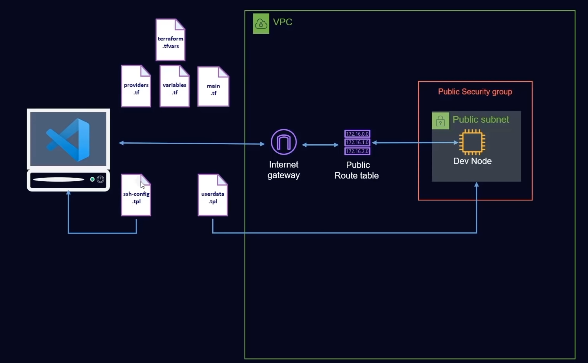

## Terraform for AWS EC2 instance in a custom VPC

This is just a small project for my personal reference or learning purpopses. It deploys a EC2 instance (there are datasources with AMIs for Ubuntu 20 and Amazon Linux 2). After the creation, it adds a configuration in your `~/.ssh/config`. This code works on both Windows and Linux/MacOS, just override a variable in `terraform.tfvars` to select your system.

This code was created based on a YouTube tutorial on freeCodeCamp channel, then modified and extended by me.

### Requirements:
* terraform installed

### How to use
* `cd terraform-deploy-ec2`
* `terraform apply -auto-approve`

### Architecture

